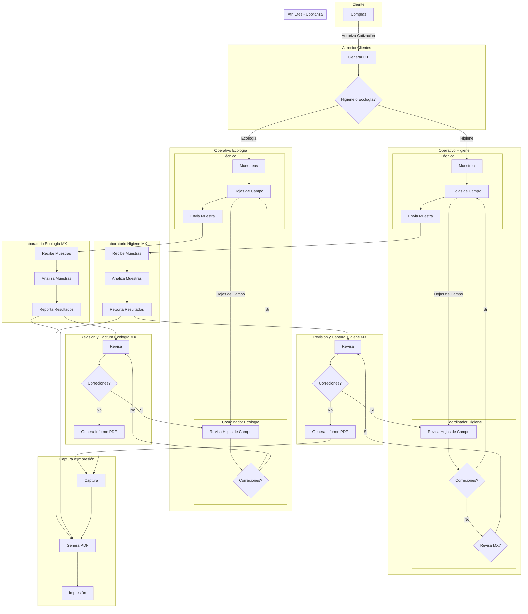

# Ciclo de vide OT - 2026
## Diagrama de procesos: Emisión de OT, Muestreo y Reporte de Resultados

```mermaid
flowchart TD

    subgraph Cliente ["Cliente"]
        CteAutCot[Compras]
    end

    subgraph AtnCte ["AtencionClientes"]
        GenOT[Generar OT]
        HigEcolEval{Higiene o Ecología?}
    end

    subgraph OpeEco ["Operativo Ecología"]
        subgraph TecEco ["Técnico"]
            TecEcoMues["Muestreas"]
            TecEcoHojas["Hojas de Campo"]
            TecEcoEnvMues["Envia Muestra"]
        end
        subgraph CorEco ["Coordinador Ecología"]
            CordEcoRevisa["Revisa Hojas de Campo"]
            CordEcoEvalHojas{"Correciones?"}
        end
    end    

    subgraph OpeHig ["Operativo Higiene"]
        subgraph TecHig ["Técnico"]
            TecHigMues[Muestrea]
            TecHigHojas["Hojas de Campo"]
            TecHigEnvMues["Envia Muestra"]
        end
        subgraph CorHig ["Coordinador Higiene"]
            CordHigRevisa["Revisa Hojas de Campo"]
            CordHigEvalHojas{"Correciones?"}
            CordHigEvalMX{"Revisa MX?"}
        end
    end

    subgraph LabEcoMX ["Laboratorio Ecología MX"]
        LabEcoMXRecMue["Recibe Muestras"]
        LabEcoMXAnaliza["Analiza Muestras"]
        LabEcoMXReporta["Reporta Resultados"]
    end    

    subgraph LabHigMX ["Laboratorio Higiene MX"]
        LabHigMXRecMue["Recibe Muestras"]
        LabHigMXAnaliza["Analiza Muestras"]
        LabHigMXReporta["Reporta Resultados"]
    end

    subgraph CaptEcoMX ["Revision y Captura Ecología MX"]
        CapEcoMxRevisa["Revisa"]
        CapEcoMxEval{"Correciones?"}
        CapEcoMxGenInfPDF["Genera Informe PDF"]    
    end    

    subgraph CaptHigMX ["Revision y Captura Higiene MX"]
        CapHigMxRevisa["Revisa"]
        CapHigMxEval{"Correciones?"}
        CapHigMxGenInfPDF["Genera Informe PDF"]    
    end

    subgraph CapLoc ["Captura e Impresión"]
        CapLocCaptura["Captura"]
        CapLocGenPDF["Genera PDF"]
        CapLocGenImp["Impresión"]
    end

    subgraph Cobranza ["Atn Ctes - Cobranza"]

    end


    %% Connections across lanes
    CteAutCot[Compras] -->|Autoriza Cotización| GenOT
    GenOT --> HigEcolEval
    HigEcolEval --> |Higiene| TecHigMues
    TecHigMues --> TecHigHojas
    TecHigHojas --> TecHigEnvMues
    TecHigEnvMues --> LabHigMXRecMue

    LabHigMXRecMue --> LabHigMXAnaliza
    LabHigMXAnaliza --> LabHigMXReporta


    TecHigHojas --> |"Hojas de Campo"| CordHigRevisa 
    CordHigRevisa --> CordHigEvalHojas
    CordHigEvalHojas -->|Si| TecHigHojas

    CordHigEvalHojas -->|No| CordHigEvalMX
    CordHigEvalMX --> |Si| CapHigMxRevisa

    LabHigMXReporta --> CapHigMxRevisa
    LabHigMXReporta --> CapLocGenPDF

    CapHigMxRevisa --> CapHigMxEval

    CapHigMxEval -->|Si| CordHigRevisa
    CapHigMxEval -->|No| CapHigMxGenInfPDF
    CapHigMxGenInfPDF --> CapLocCaptura


    HigEcolEval --> |Ecología| TecEcoMues
    TecEcoMues --> TecEcoHojas
    TecEcoHojas --> TecEcoEnvMues
    TecEcoEnvMues --> LabEcoMXRecMue  
    LabEcoMXRecMue --> LabEcoMXAnaliza
    LabEcoMXAnaliza --> LabEcoMXReporta
    LabEcoMXReporta --> CapEcoMxRevisa

    LabEcoMXReporta --> CapLocGenPDF

    TecEcoHojas --> |"Hojas de Campo"| CordEcoRevisa 
    CordEcoRevisa --> CordEcoEvalHojas
    CordEcoEvalHojas -->|Si| TecEcoHojas

    CordEcoEvalHojas -->|No| CapEcoMxRevisa    

    CapEcoMxRevisa --> CapEcoMxEval

    CapEcoMxEval --> |No|CapEcoMxGenInfPDF
    CapEcoMxGenInfPDF --> CapLocCaptura

    CapEcoMxEval --> |Si| CordEcoRevisa


    CapLocCaptura --> CapLocGenPDF
    CapLocGenPDF --> CapLocGenImp

 

    

```